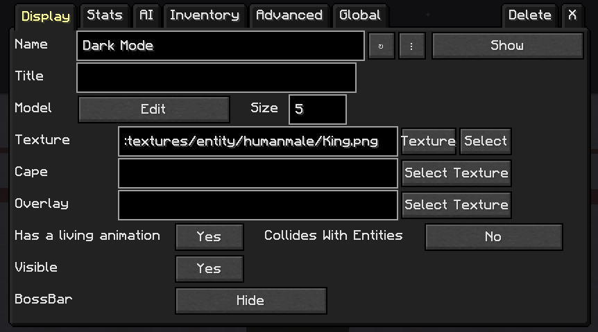
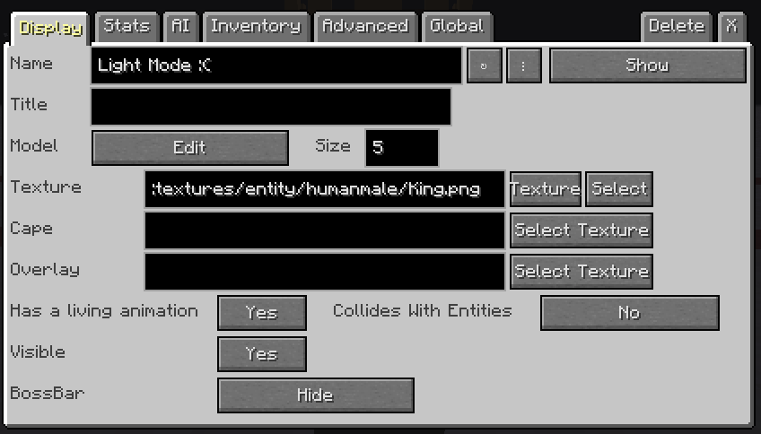
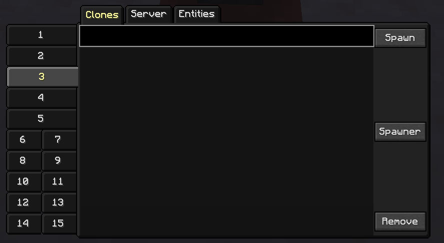
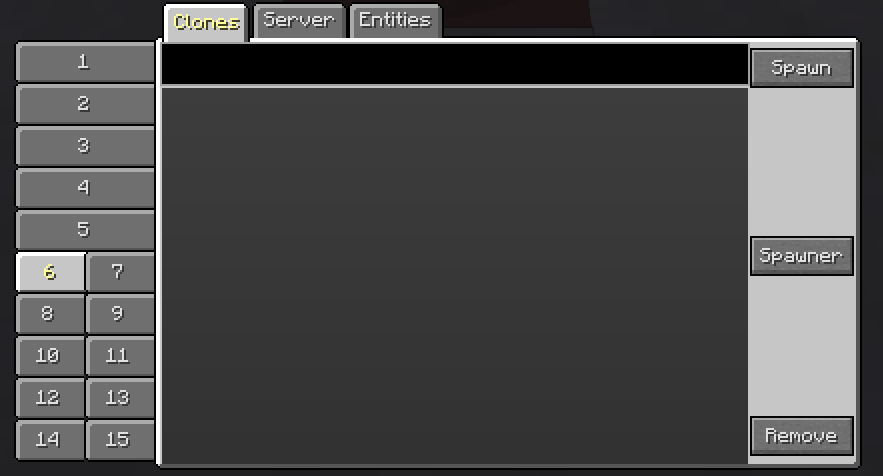
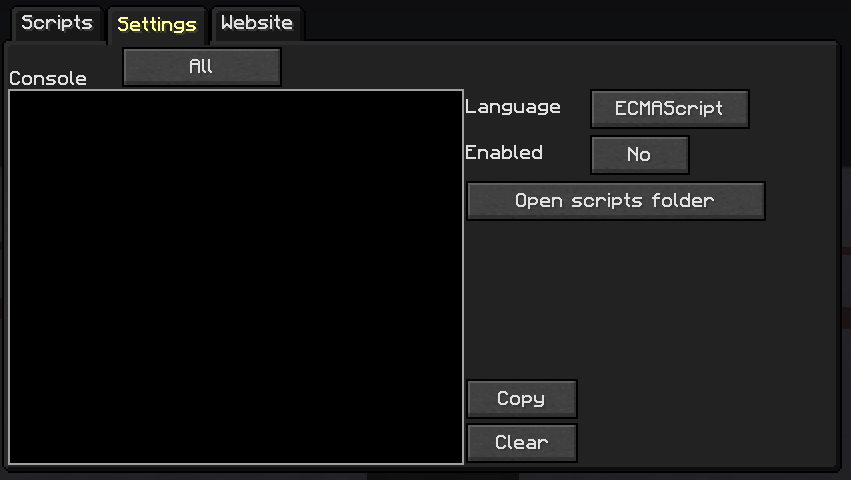
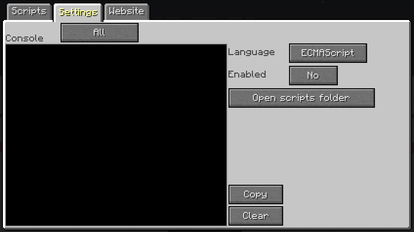

## 👋 Welcome to the CustomNPC+ Dark Mode Repository.
  

> CustomNPC+ Dark Mode is a [Minecraft](https://minecraft.net/) resource pack that allows you to alter the coloration of the GUIs within the 1.7.10 @[CustomNPC+ Mod](https://www.curseforge.com/minecraft/mc-mods/customnpc-plus).

### 🔹 Installation
Simply add the resource pack to the resource pack folder in your directory of choice. Enable the resource pack and then you're set! The buttons within the GUI are controlled by Minecraft's button textures, if you wish to have the Dark Button that are present in the images below then check out this other Dark Mode Resource Pack: @[Darkmode](https://www.curseforge.com/minecraft/texture-packs/darkmode)

### ❓ Features:
- Dark GUIs
- That's it.

## 🔰 Dark Mode Images:
#### NPC Gui
 

#### Clone Gui
 

#### Script
 

## 🔗 Want to check out my other projects?
[Plugin Mod](https://github.com/KAMKEEL/Plugin-Mod) is a mod designed to add more aesthetic items for RPG and storytelling. It is compatible with CustomNPC+ and has many items intended to be used and wielded by created NPCs.

[RPG Messenger](https://github.com/KAMKEEL/RPGMessenger) is a bukkit plugin designed to allow operators to create messagable NPCs for RPG Servers. Allows a 'RPG Controller' to reply quickly as NPCs, form groupchats, and messagable parties.

